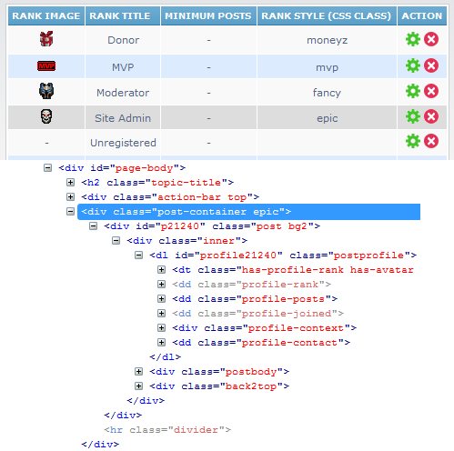
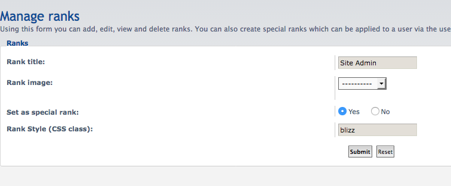

Rank Post Styling for phpBB 3.2/3.3
=======================================

#### Description
Extension for phpBB 3.1/3.2 that adds a CSS rule option to user ranks. 
Useful for styling posts of special users.

Rank Listing 


Manage ranks


#### Version
v1.0.7 (29-06-2020)
[](https://travis-ci.org/Sajaki/rankpoststyling)

### Changelog 
- 1.0.7 (29/06/2020)
  - [NEW] phpBB 3.3 support. 
  - [NEW] dropped support for 3.1
  
- 1.0.6 (13/12/2017)
  - [NEW] pbWoW heroes support

- 1.0.5 (18/09/2017)
  - [NEW] phpBB 3.2

- 1.0.4 (20/03/2016)
  - [NEW] autoload css in overall_header_head_append_
  - [NEW] Italian translation (Mauron)     
  - [CHG] add tutorial

### Features
- Integration with phpBB ranks ACP module
- Allows admin to specify a CSS class rule for each "special" rank
- CSS class rule is applied to `<div class="post-container">` which wraps posts
- Available in:
  - Viewtopic
  - Search results (posts mode)
  - Memberlist (viewprofile)
- Gives total control to style whatever you like (fonts, colors, images, etc.)  

#### Requirements
- phpBB 3.2.0 or higher

#### Languages supported
- English, Spanish, Arabic, Croatian, Polish, French, Turkish, Italian

## Installation
1. [Download the latest release](http://www.avathar.be/forum/app.php/dl_ext/?cat=2) and unzip it.
2. Copy the entire contents from the unzipped folder to `/ext/paybas/rankpoststyling/`.
3. Navigate in the ACP to `Customise -> Manage extensions`.
4. Find `Rank Post Styling` under "Disabled Extensions" and click `Enable`.

#### Tutorial
1. go to ACP -> Users and Groups -> Manage Ranks. There is now a new column 'Rank Style'. 
2. here you can define the css style that will be applied to the post content from members with this rank.
3. the example css 'rankpoststyling.css' will now be applied to post content of all ranked posts. 
4. pbWoW & pbTech have other predefined rank styles that you can apply in ACP. 

#### Warning!
You need to be abit familiar with HTML and CSS. 

In manage ranks, assign a css class that you define to your ranks. 
Then, all post-container classes for will be appended with the assigned css class for the rank of the user that posted. 
As an example, the pbWoW style contains 2 content styling classes : "blizz" and "mvp". 
You would then need to assign these classes to your ranks. 
 ```
 .blizz .content { color: #00C0FF; }
 .blizz .content strong { color: #FFF; }
 .mvp .content { color: #5DF644; }
 .mvp .content strong { color: #FFF; }
```
No support will be given beyond the actual functionality of the extension. All styling is up to you.

#### Uninstallation
1. Navigate in the ACP to `Customise -> Manage extensions`.
2. Click the `Disable` link for `Rank Post Styling`.
3. To permanently uninstall, click `Delete Data`, then delete the `rankpoststyling` folder from `/ext/paybas/`.

### License
[GNU General Public License v2](http://opensource.org/licenses/GPL-2.0)

© 2015 - PayBas
© 2017 - Sajaki
